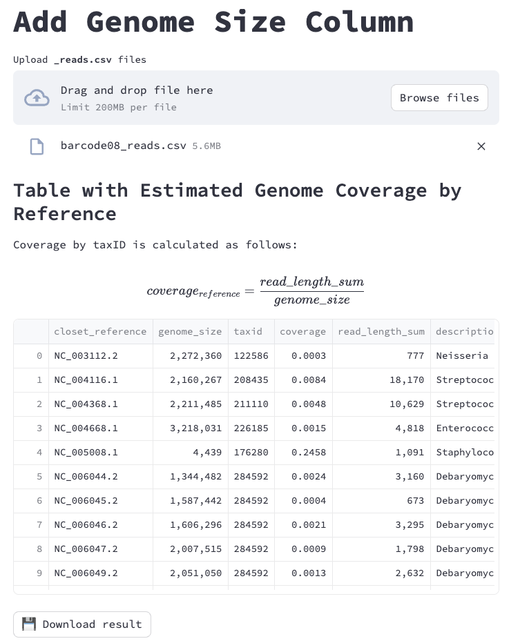
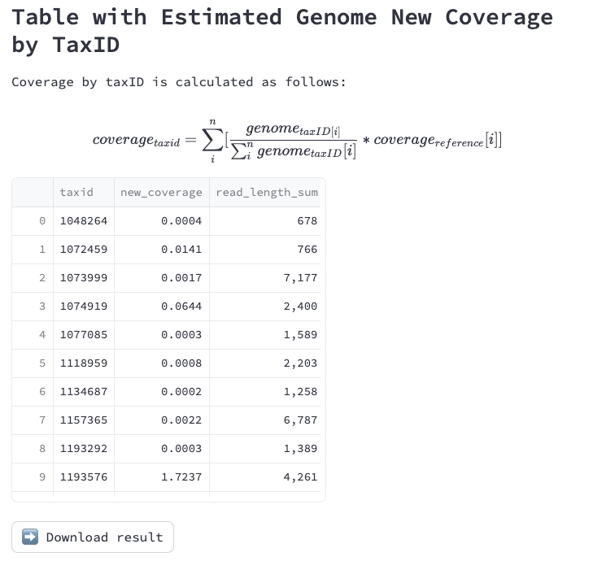

### Simple streamlit app to estimate coverage from the results of https://github.com/thanhleviet/nf-ont-taxamap

#### Streamlit cloud

#### Local run
Requires: `python >=3.10` and [poetry](https://python-poetry.org/)
```
git clone https://github.com/thanhleviet/st_estimate_coverage
cd st_estimate_coverage
poetry install
streamlit run app.py
```




